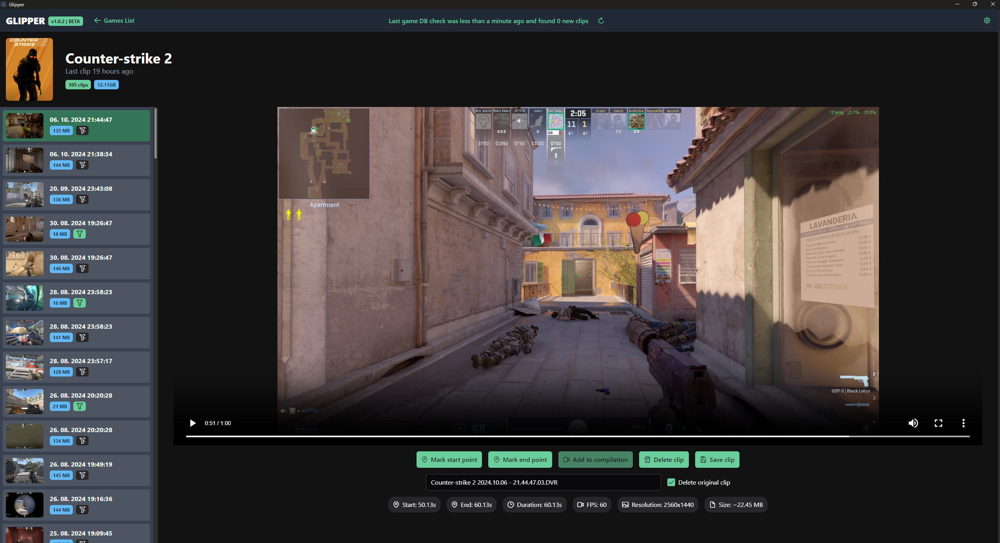
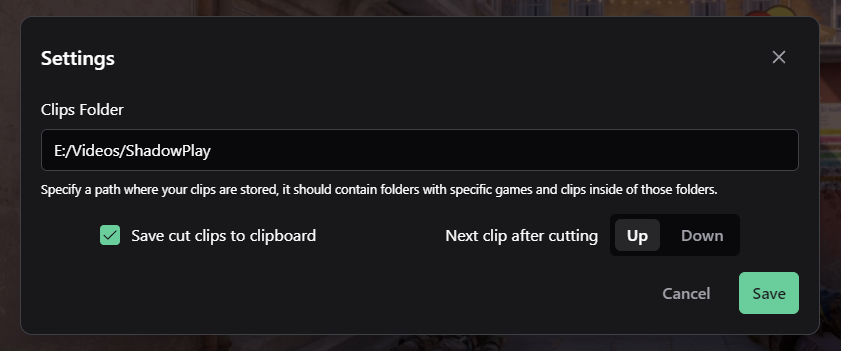

# Glipper 🎮🎥

Glipper is an intuitive Electron app that scans your game clips folder and provides a sleek interface for browsing, organizing, and selecting your favorite game clips. It allows you to filter clips by game and pick specific clips for editing or sharing, making clip management a breeze.

> **⚠️ Alert: This app is currently not finished and is actively being worked on.**

---

## Features ✨

-   **Scan Your Clips Folder**: After inputting your clips folder, Glipper tries to automatically parse all your games, downloading posters and creating thumbnails for your games and clips.
-   **Quick Clip Previews**: Instantly preview any clip within the app.
-   **Simple Editing Workflow**: Select a clip, edit it and even delete it without leaving the app.
-   **Easy Clip Sharing**: You can opt in to automatically copy the cut clip into clipboard so that you can just paste it into your app of choice (Discord, Slack, Messenger...).
-   **Many more to come!**: Glipper is still being developed, more features like creating compilations from multiple clips, converting clips into different or smaller formats and others are coming!

> **⚠️ Alert: The app currently only expects this folder layout: [folder]/[game-name]/[clip-name].**

---

## Installation 💾

To get started with Glipper, follow these steps:

### 1. Download & Install

Head over to the [releases page](https://github.com/MrJamesT/glipper/releases) to download the latest version for your platform.

-   **Windows**: Download the `.exe` file and follow the on-screen instructions.
-   **macOS**: Download the `.dmg` file, open it, and drag the Glipper icon into your Applications folder.
-   **Linux**: Download the appropriate binary for your distribution.

### 2. Clone & Run Locally (Development)

If you want to run the app locally or contribute, follow these steps:

1. Clone the repository:
   `git clone https://github.com/MrJamesT/glipper.git`

2. Navigate to the project directory:
   `cd glipper`

3. Install dependencies:
   `pnpm install`

4. Generate Prisma Client:
   `pnpm prisma:generate`

5. Run the app:
   `pnpm dev`

---

## Usage 🕹️

1. **Set your Clip Folder**: Upon launching Glipper, open the settings menu in the upper-right corner and set the folder where your game clips are stored. You can always change this later in the settings.
2. **Browse by Game**: Once your folder is set, Glipper will scan and categorize your clips by game titles.
3. **Select & Edit**: Choose the game, and then pick the clip you want to work on. You can preview and edit the clip within the app.
4. **Save & Share**: Export the edited clips and share them on your favorite platforms.

---

## Contributing 🤝

Contributions from anyone are welcome! If you'd like to contribute:

1. Fork the repository.
2. Create a new branch (\`git checkout -b feature-branch\`).
3. Commit your changes (\`git commit -m 'Add a cool feature'\`).
4. Push to the branch (\`git push origin feature-branch\`).
5. Open a Pull Request.

---

## License 📄

This project is licensed under the GPL-3.0 license. See the [COPYING](COPYING) file for details.

---

## Support 📧

If you encounter any issues or have any questions, feel free to open an [issue](https://github.com/MrJamesT/glipper/issues).

---

Made with ❤️ using [Electron](https://www.electronjs.org/) and [Vue.js](https://vuejs.org/).
